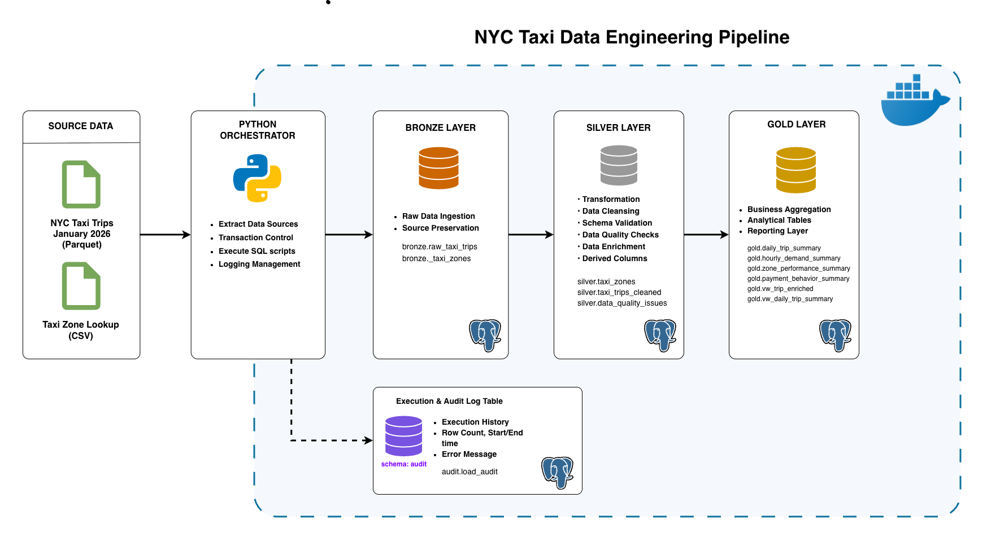
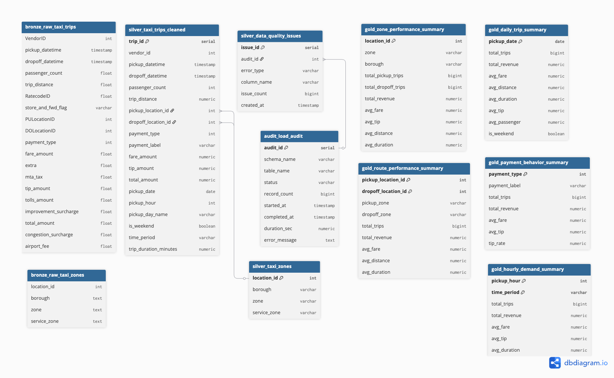

# NYC Taxi Data Engineering Pipeline

An end-to-end batch ETL pipeline that processes the **NYC Yellow Taxi Trips** and **Taxi Zone Lookup** datasets into a PostgreSQL data warehouse using the **Medallion Architecture (Bronze, Silver, and Gold)**.

Python is used to orchestrate the pipeline execution, automate data ingestion, and manage database transactions, while PostgreSQL serves as the primary processing engine, performing data loading, transformation, validation, and aggregation entirely through SQL scripts and database functions.

---

## Table of Contents

- [Project Overview](#project-overview)
- [Architecture](#architecture)
- [ETL Pipeline Workflow](#etl-pipeline-workflow)
- [Pipeline Execution Flow](#pipeline-execution-flow)
- [Technology Stack](#technology-stack)
- [Dataset](#dataset)
- [Data Warehouse Design (ERD)](#data-warehouse-design-erd)
- [Project Structure](#project-structure)
- [How to Run](#how-to-run)
- [Pipeline Output](#pipeline-output)
- [Current Limitations](#current-limitations)

---

## Project Overview

This project implements a batch ETL pipeline using PostgreSQL for data transformation and Python for pipeline orchestration.

The pipeline loads raw NYC Taxi datasets into the Bronze layer, applies data cleaning and feature engineering in the Silver layer, and creates aggregated tables in the Gold layer for analytical queries. It also records pipeline execution metadata and logs detected data quality issues.

---

## Architecture



The pipeline follows the standard **Medallion Architecture** pattern:
* **Bronze:** Ingests and stores raw source data with no schema alterations.
* **Silver:** Performs data validation, cleaning, standardizations, and feature engineering.
* **Gold:** Contains business-level aggregated datasets for analytical reporting.
* **Audit:** A dedicated logging schema that records end-to-end pipeline execution metadata.

---

##  ETL Pipeline Workflow

The operational workflow is broken down into four distinct structural phases:

### 1. Extract
* Download NYC Taxi Trips dataset directly from public endpoints.
* Download Taxi Zone Lookup CSV reference file.
* Load raw files into the Bronze layer tables.

### 2. Transform
* Validate mandatory constraints attributes.
* Filter out invalid records based on business rules.
* Standardize categorical values into human-readable labels.
* Perform feature engineering.
* Quantify and isolate bad records into data quality issue tables.

### 3. Load
* Populate transactionally safe Silver tables.
* Compute and upsert Gold analytical summary marts.

### 4. Audit
* Log pipeline run metadata status (`RUNNING`, `SUCCESS`, `FAILED`).
* Capture processed row counts per layer.
* Track execution duration metrics.
* Capture exact stack traces and error messages upon failure.

---

## Pipeline Execution Flow

```text
Pipeline Started
       │
       ▼
Create Audit Record
(Status = RUNNING)
       │
       ▼
Execute SQL Scripts
       │
       ├──────────────┐
       │              │
       ▼              ▼
 Success          Failure
       │              │
       ▼              ▼
Update Audit     Update Audit
(Status=SUCCESS) (Status=FAILED)
       │              │
       ▼              ▼
 COMMIT         ROLLBACK
```

## Technology Stack

| Technology | Usage |
|------------|-------|
| Python 3.13 | Orchestrates the ETL pipeline, executes SQL scripts, and manages database transactions |
| PostgreSQL | Stores data and executes SQL-based transformations |
| SQL | Defines database objects, transformation logic, and analytical queries |
| Docker | Runs PostgreSQL in a consistent development environment |
| Git & GitHub | Version control and project hosting |

## Dataset

This project uses two public datasets provided by the New York City Taxi and Limousine Commission (TLC).

| Dataset | Format | Description | Source |
|---------|--------|-------------|--------|
| NYC Yellow Taxi Trips (January 2026) | Parquet | Contains taxi trip records, including pickup and dropoff times, passenger count, trip distance, fare, payment type, and location IDs. | [NYC TLC Yellow Taxi Trips](https://d37ci6vzurychx.cloudfront.net/trip-data/yellow_tripdata_2026-01.parquet) |
| Taxi Zone Lookup | CSV | Maps location IDs to taxi zones, boroughs, and service zones. | [NYC TLC Taxi Zone Lookup](https://d37ci6vzurychx.cloudfront.net/misc/taxi_zone_lookup.csv) |


## Project Structure

```text
sql-pipeline-nyc-taxi/
│
├── config/                 # Configuration files
├── data/                   # Source datasets
├── docs/                   # Documentation and diagrams
├── logs/                   # Pipeline logs
├── scripts/                # Shell scripts for running the pipeline
│
├── sql/
│   ├── init/               # Database initialization scripts
│   ├── bronze/             # Raw data loading
│   ├── silver/             # Data cleaning and transformation
│   ├── gold/               # Analytical summary tables
│   ├── analytics/          # Example business queries
│   └── views/              # SQL views used by Gold transformations
│
├── src/
│   ├── database/           # Database connection and SQL execution
│   ├── pipeline/           # ETL workflow
│   └── audit/              # Audit logging
│
├── Dockerfile
├── docker-compose.yml
├── main.py
├── requirements.txt
└── README.md
```

## Data Warehouse Design (ERD)



The data warehouse consists of four logical layers.

| Layer | Description |
|-------|-------------|
| Bronze | Raw source datasets |
| Silver | Cleaned, validated, and enriched datasets |
| Gold | Aggregated tables for reporting |
| Audit | Pipeline execution logs |

Detailed table descriptions are available in `docs/data_warehouse.md`.

## How to Run

---

### 1. Clone the Repository

```bash
git clone https://github.com/agungngrh/sql-pipeline-nyc-taxi.git

cd sql-pipeline-nyc-taxi
```

### 2. Configure Environment Variables

Copy the example file:

```bash
cp .env.example .env
```

The values in `.env.example` are the default configuration used by the Docker containers. You may modify them if you want to use different PostgreSQL credentials, but the values must remain consistent with the Docker Compose configuration.

Example:

```env
POSTGRES_HOST=postgres
POSTGRES_PORT=5432
POSTGRES_DB=ny_taxi_db
POSTGRES_USER=postgres
POSTGRES_PASSWORD=postgres
```

### 3. Build and Run the Pipeline

```bash
docker compose up --build
```

#### PostgreSQL Command Line

```bash
docker compose exec ny_taxi_postgres psql -U postgres -d ny_taxi_db
```

Example queries:

```sql
SELECT COUNT(*) FROM silver.taxi_trips_cleaned;

SELECT COUNT(*) FROM gold.daily_trip_summary;

SELECT * FROM audit.load_audit;
```

## Pipeline Output

Successful pipeline execution produces:

| Layer | Output |
|-------|--------|
| Bronze | 2 raw tables |
| Silver | 2 cleaned tables |
| Gold | 5 analytical summary tables |
| Audit | Pipeline execution log |

Detailed execution statistics are available in:

```text
docs/pipeline_report.md
```

Business analysis examples are available in:

```text
docs/insight_report.md
```

---

## Current Limitations

- The project does not yet include automated unit tests (e.g., using Pytest) to validate the Python orchestration components.
- The Silver layer applies validation rules based on general assumptions (e.g., positive values, valid datetime order, and valid fare_amount and so on) without performing a deeper Exploratory Data Analysis (EDA). A more comprehensive EDA combined with domain knowledge could refine the validation rules and reduce the risk of incorrectly classifying records as invalid.
- The project enforces strict database constraints (CHECK) to maintain data integrity. While this simplifies data validation, some records that violate these constraints may still be valid under specific business scenarios. More domain-specific validation rules would improve the accuracy of data quality assessment.
- The current approach separates records into valid and invalid datasets by excluding records that fail validation from the Silver table. An alternative design would be to retain all records in `silver.taxi_trips_cleaned` and add validation flag columns (for example, fare_validity_status, is_impossible_speed, is_valid_record or rule-specific flags). The `silver.data_quality_issues` table could then reference only the flagged records, allowing the Silver layer to preserve the complete dataset while still providing detailed data quality reporting.

